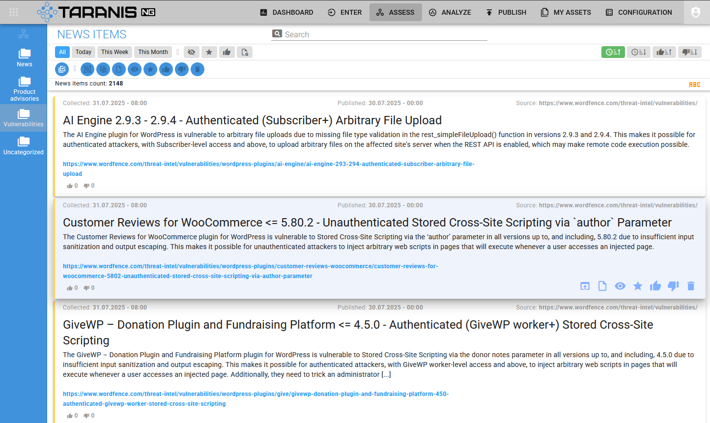

# Taranis NG

Taranis NG is an OSINT gathering and analysis tool for CSIRT teams and
organisations. It allows osint gathering, analysis and reporting; team-to-team
collaboration; and contains a user portal for simple self asset management.

Taranis crawls various **data sources** such as web sites or tweets to gather
unstructured **news items**. These are processed by analysts to create
structured **report items**, which are used to create **products** such as PDF
files, which are finally **published**.

Taranis supports **team-to-team collaboration**, and includes a light weight
**self service asset management** which automatically links to the advisories
that mention vulnerabilities in the software.

This is just a taste of its features:

- crawl the raw data using various collectors, perhaps located in different environments.
- process even those javascript-generated web pages with advanced data extraction techniques
- create different analyses with completely customizable report item types
- generate many different products with help of product templates
- easily publish to different channels
- time is money: collaborate with other teams by sharing interesting data. Each partnership can be configured and customized.
- split the work responsibilities any way you like, or have multiple teams process partially overlapping data using advanced role and permission system
- use wordlists for filtering and highlighting
- publish the self-service asset management portal to your constituency and allow them to set various notification profiles for those times when a vulnerability hits their product.

### Hardware requirements
make sure to have at least 2 GB of RAM, 2 CPU cores and 5 GB of disk storage available for running,
20 GB of disk storage if you want to build the project from scratch.

## Getting started with Docker installation

Currently, the best way to deploy is via Docker. For Docker installation see [Docker README](docker/README.md).

When your Taranis NG instance is up and running, visit your instance by
navigating to [https://localhost:4443](https://localhost:4443/) using your web
browser. **The default credentials are `user` / `user` and `admin` / `admin`.**

### Connecting to collectors, presenters, and publishers

After installation, you have to connect the core application with collectors,
presenters, and publishers. There is no limit to how many of these you have.
The default docker installation deploys one instance of each for you automatically.

- Adding a `collector node`: no action needed. This is done automatically on startup if no collector nodes are defined.

- Adding a `bot node`: no action needed. This is done automatically on startup if no bot nodes are defined.

- Adding a `presenter node`: Log in as an `admin`, then navigate to Configuration
-> Presenters nodes. Click `Add new`. Enter any name and description. For URL,
enter `http://presenters/` and for key, enter `supersecret` (or whatever
password you chose during the installation). Click `Save`.

- Adding a `publisher node`: repeat the process at Configuration -> Publishers
nodes. Fill in the fields. For URL, enter `http://publishers/`. Don't forget to
set the password.

## Learn more...

For instructions on configuring other components, refer to the [How to guide](docs/howto.md).

You can view the architecture block diagram [here](docs/images/block-diagram.png).

Have a look at the [Taranis NG - original requirements.pdf](docs/Taranis-NG-original-requirements.pdf)
for detailed description of the features of the first release, its internal
architecture, and general design goals of the project.
Please note that the version available today already contain new features
and changes, which are not documented in this PDF.

#### Node type capabilities

| Type      | Name                 | Description                           |
| :-------- | :------------------- | :------------------------------------ |
| Collector | web                  | crawl web sites                       |
|           | email                | read e-mails                          |
|           | manual entry         | enter news item manually              |
|           | rss                  | read RSS, Atom feeds                  |
|           | scheduled tasks      | populate feed automatically           |
|           | slack                | read [Slack](https://slack.com/) messages |
|           | twitter              | receive tweets                        |
| Presenter | html                 | create HTML from template             |
|           | json                 | create a json file                    |
|           | message              | create a email message  from template |
|           | misp                 | create [MISP](https://misp-project.org/) event JSON |
|           | pdf                  | create a PDF file from template       |
|           | text                 | create plain text from template       |
| Publisher | email                | send e-mail                           |
|           | mastodon             | create Mastodon tweet                 |
|           | misp                 | create MISP event                     |
|           | ftp, sftp            | upload to FTP, SFTP                   |
|           | twitter              | create tweet                          |
|           | wordpress            | publish to [WordPress](https://wordpress.org/) |
| Bot       | analyst              | extract attributes from text by regular expressions |
|           | grouping             | group similar items in the news feed  |
|           | wordlist updater     | update word lists used for matching   |

## About

This project was inspired by [Taranis3](https://github.com/NCSC-NL/taranis3),
a great tool made by NCSC-NL. Currently, NCSC-NL has a new tool for producing advisories,
with a different approach to communicating with the world. There was no funding to maintain or
further develop NCSC-NL's Taranis3.

It aims to become a next generation of this category of tools. The project was made in collaboration
with a wide group of European CSIRT teams who are developers and users of Taranis3, and would not be
possible without their valuable input especially during the requirements collection phase.
The architecture and design of new Taranis NG is a collective brain child of this community.

Taranis NG was developed by [SK-CERT](https://www.sk-cert.sk/) with a help from
wide CSIRT community, and is released under terms of the [European Union Public
Licence](https://eupl.eu/1.2/en/).

This project has been co-funded by European Regional Development Fund as part of [Operational Programme Integrated Infrastructure (OPII)](https://www.opii.gov.sk/opii-en/titulka-en).

Further development has been co-funded by “Connecting Europe Facility – Cybersecurity Digital Service Infrastructure Maintenance and Evolution of Core Service Platform Cooperation Mechanism for CSIRTs – MeliCERTes Facility” (SMART 2018/1024).

Further development is being co-funded by European Commission through the Connecting Europe Facility action entitled "Joint Threat Analysis Network", action number 2020-EU-IA-0260.

