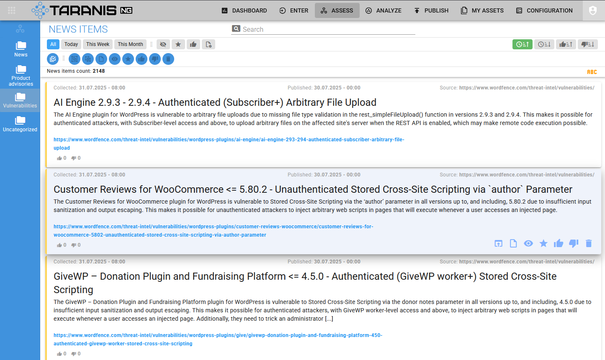

# Taranis NG

Taranis NG is an OSINT gathering and analysis tool for CSIRT teams and
organisations. It supports OSINT gathering, analysis and reporting;
team-to-team collaboration; and includes a user portal for simple self-service
asset management.

Taranis crawls various **data sources** such as web sites or tweets to gather
unstructured **news items**. These are processed by analysts to create
structured **report items**, which are used to create **products** such as PDF
files, which are finally **published**.

Taranis supports **team-to-team collaboration**, and includes a lightweight
**self-service asset management** portal which automatically links to advisories
that mention vulnerabilities in the software.

## Languages

The Vue 3 GUI includes translations for Brazilian Portuguese, Czech, Dutch,
English, French, German, Hindi, Italian, Japanese, Korean, Polish, Russian,
Simplified Chinese, Slovak, Spanish, Thai, Turkish, Ukrainian, and Vietnamese.
The legacy Vue 2 GUI includes Czech, English, and Slovak. English is the
fallback language in both interfaces.

Key capabilities include:

- collecting data from multiple source types and environments;
- extracting content from JavaScript-rendered web pages;
- creating analyses with configurable report-item types;
- generating products from reusable templates;
- publishing through multiple channels;
- sharing selected data between teams with configurable collaboration rules;
- separating responsibilities through roles and permissions;
- filtering and highlighting with word lists; and
- offering self-service asset and vulnerability notification management.

### Hardware requirements

Allow at least 2 GB of RAM, 2 CPU cores, and 5 GB of disk space to run the
containers. Allow at least 20 GB of disk space when building all application
images from source.

## Getting started with Docker installation

Docker Compose is the current deployment path. Use the
[Docker deployment guide](docker/README.md) as the single source for current
installation commands, security warnings, initialization limitations, and
verification steps.

## Learn more...

For instructions on configuring other components, refer to the [How to guide](docs/howto.md).

You can view the architecture block diagram [here](docs/images/block-diagram.png).

The [requirements and design reference](docs/Taranis-NG-original-requirements.pdf)
describes the product's design goals. Use the Docker guide and current source
documentation for installation and operations.

#### Node type capabilities

| Type      | Name             | Description                                         |
| :-------- | :--------------- | :-------------------------------------------------- |
| Collector | web              | crawl web sites                                     |
|           | email            | read e-mails                                        |
|           | manual entry     | enter news item manually                            |
|           | rss              | read RSS, Atom feeds                                |
|           | scheduled tasks  | populate feed automatically                         |
|           | slack            | read [Slack](https://slack.com/) messages           |
|           | twitter          | receive tweets                                      |
| Presenter | html             | create HTML from template                           |
|           | json             | create a json file                                  |
|           | message          | create a email message from template                |
|           | misp             | create [MISP](https://misp-project.org/) event JSON |
|           | pdf              | create a PDF file from template                     |
|           | text             | create plain text from template                     |
| Publisher | email            | send e-mail                                         |
|           | mastodon         | create Mastodon tweet                               |
|           | misp             | create MISP event                                   |
|           | ftp, sftp        | upload to FTP, SFTP                                 |
|           | twitter          | create tweet                                        |
|           | wordpress        | publish to [WordPress](https://wordpress.org/)      |
| Bot       | analyst          | extract attributes from text by regular expressions |
|           | grouping         | group similar items in the news feed                |
|           | wordlist updater | update word lists used for matching                 |

## About

This project was inspired by [Taranis3](https://github.com/NCSC-NL/taranis3),
a great tool made by NCSC-NL. Currently, NCSC-NL has a new tool for producing advisories,
with a different approach to communicating with the world. There was no funding to maintain or
further develop NCSC-NL's Taranis3.

It aims to become a next generation of this category of tools. The project was made in collaboration
with a wide group of European CSIRT teams who are developers and users of Taranis3, and would not be
possible without their valuable input especially during the requirements collection phase.
The architecture and design of new Taranis NG is a collective brain child of this community.

Taranis NG was developed by [SK-CERT](https://www.sk-cert.sk/) with a help from
wide CSIRT community, and is released under terms of the [European Union Public
Licence](https://eupl.eu/1.2/en/).

This project has been co-funded by European Regional Development Fund as part of [Operational Programme Integrated Infrastructure (OPII)](https://www.opii.gov.sk/opii-en/titulka-en).

Further development has been co-funded by “Connecting Europe Facility – Cybersecurity Digital Service Infrastructure Maintenance and Evolution of Core Service Platform Cooperation Mechanism for CSIRTs – MeliCERTes Facility” (SMART 2018/1024).

Further development is being co-funded by European Commission through the Connecting Europe Facility action entitled "Joint Threat Analysis Network", action number 2020-EU-IA-0260.

