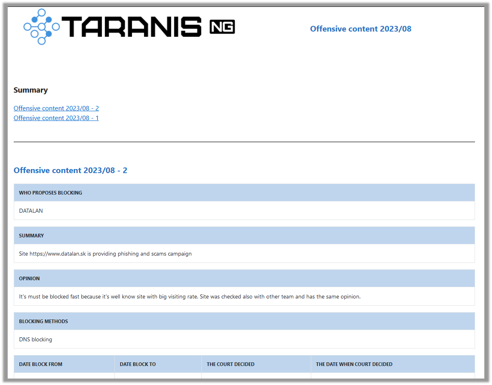


# Contents
[OSINT Report](#_toc1)

[Weekly Summary](#_toc2)

[Offensive content report](#_toc3)

[Disinformation from Public Source Report](#_toc4)

# OSINT Report

- It’s summary report about various cyber events
- The report contains various items of information sorted by sections:
  - Weekly Summary
    - Sector/Threat, Comment, Trend
- Statistics and Dashboards
  - Incidents per Sector
  - Incidents per Threat Type
- Recent Known Exploited Vulnerabilities
  - CVE, CVSS v3, Date,
  - Affected systems (CPE Codes)
- Ransomwares
  - Sector, Actor, Comment, Dashboard
- Latest Cyber Events
  - Event noted on, Sector, Threat actor,
  - Threat type, Severity, Confidence

**Usage:**

Create some new **Report items** with type **Vulnerability** **report, OSINT Report – Summary, OSINT Report – Ransomware, OSINT Report – Sectors, OSINT Report – Threats** and **OSINT Report - Cyber Event**.

To use all the report possibilities, you should add all types of report items to final product:

- **OSINT Report – Summary** – Main report text (Title, Summaries, Trends, Threat level, TLP)
- **OSINT Report – Ransomware** – Ransomware's part of the report (Name, Actor, Sector, Incidents)
- **OSINT Report – Sectors** – Sectors part of the report (Comment, Incidents, Trend)
- **OSINT Report – Threats** – Threats section of the report (Comment, Incidents, Trend)
- **OSINT Report – Cyber Event** – Cyber Events section of the report (Description, Sector, Threat actor, Threat type, Severity, Confidence)
- **Vulnerability Report -** Vulnerabilities section of the report (CVE, CVSS v3, Date, Affected systems)

Then create new **Product** with type **OSINT Weekly Report** and add your previous created Report items.

This report is inbuilt in Taranis (version after 2023/09)

If you need to edit the report design, use this HTML template: **/app/templates/template\_osint.html**

# Weekly Summary

- It is summary report what happened for last week (vulnerabilities, news...)
- The report contains various items of information: 
  - Vulnerability Report
    - Confidentiality, TLP
    - CVSS vector, Description
    - Exposure and Update Date
    - CVE, Impact, IOC
    - Affected Systems
    - Recommendations
    - Links
  - News by sectors
    - NIS Sector
    - Date
    - Headline
    - Article
###
**Usage:**

Create some new **Report items** with type **Vulnerability** **report** or **News by Sector**. Then create new **Product** with type **Weekly Bulletin** and add your previous created Report items. 

To use all the reporting possibilities, you should add all types of these report items to final product:

- **Vulnerability** **report** – Vulnerability part of the report
- **News by Sector** – Sector news part of the report

This report is inbuilt in Taranis (version after 2023/09)

If you need to edit the report design, use this HTML template: **/app/templates/weekly.html**

# Offensive content report

- It’s summary report for offensive content blocking
- The report contains various items of information: 
  - Who proposes blocking
  - Summary
  - Opinion
  - Blocking methods
  - Date block From, To
  - The court decided and date when

**Usage:**

Create some new **Report items** with type **Offensive content**. Then create new **Product** with type **Offensive Content** and add your previous created Report items.

This report is inbuilt in Taranis (version after 2023/09)

If you need to edit the report design, use this HTML template: **/app/templates/template\_content.html**

# Disinformation from Public Source Report

- It’s summary report about disinformation from public sources
- The report contains various items of information: 
  - Source (link)
  - Title, Quote
  - Reach, Reach To Date
  - Proof, Category
  - Interpretation/evaluation
  - Recommendation

**Usage:**

Create some new **Report items** with type **Disinformation from public source**. Then create new **Product** with type **Disinformation** and add your previous created Report items.

This report is inbuilt in Taranis (version after 2023/09)

If you need to edit the report design, use this HTML template: **/app/templates/template\_disinfo.html**

